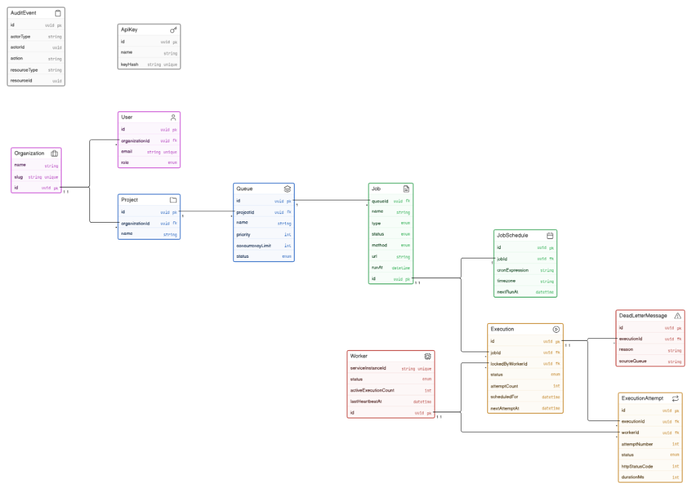
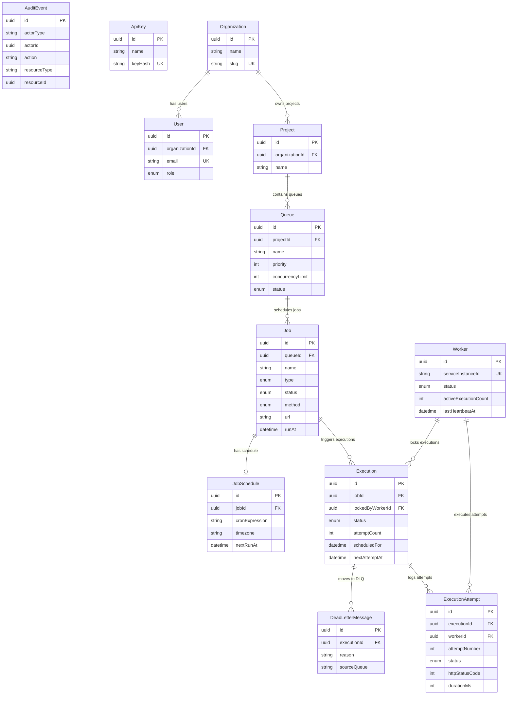

# Entity Relationship Diagram

This document describes the database schema and entity relationships for the Distributed Job Scheduling Platform.

## Visual ER Diagram

---

## Mermaid ER Diagram

---

## Key Design Decisions

### Primary Keys & Identifiers
All primary keys use **UUID v4** strings, preventing ID enumeration attacks and ensuring safe distributed ID generation.

### Foreign Keys & Relationships
| Parent Entity | Child Entity | Relationship Type | Cascading Behavior |
|---|---|---|---|
| Organization | User | 1 : N | Restrict |
| Organization | Project | 1 : N | Cascade |
| Project | Queue | 1 : N | Cascade |
| Queue | Job | 1 : N | Cascade |
| Job | JobSchedule | 1 : 1 | Cascade |
| Job | Execution | 1 : N | Cascade |
| Execution | ExecutionAttempt | 1 : N | Cascade |
| Execution | DeadLetterMessage | 1 : N | SetNull |
| Worker | Execution | 1 : N | SetNull |
| Worker | ExecutionAttempt | 1 : N | SetNull |
